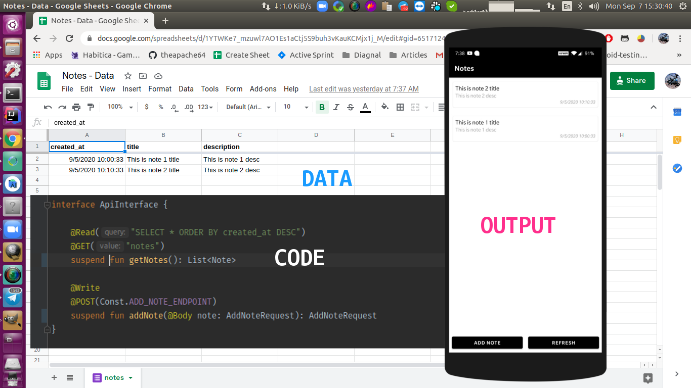

# retrosheet 📄
Turn Google Spreadsheet to JSON endpoint. [For Android and JVM].



## Benefits

- Since you're using Google's server, you don't have to worry about server health.
- Rapid response and unlimited bandwidth
- Since we're using `OkHttpInterceptor` under the hood, you can easily migrate to your REST API without 
any significant code change.
- You don't have to create an admin panel/dashboard to control the data. You can simply use Google Spreadsheet app.
- You can use this library to create POC/MVP instantly 

## Install 🤝 

```groovy
    implementation 'com.theapache64:retrosheet:1.2.1'
```

## Usage ⌨️ 

#### Step 1 : Writing Data To Sheet

- [Create a Google Form](https://docs.google.com/forms/u/0/) with some fields


#### Step 2

- Select response destination and select/create a Google sheet to store the responses.


#### Step 3

- Now you can open the sheet and change sheet name and column names if you want. 
 This is just to make the Google sheet table look like a real database table (optional)

I've changed

to 


#### Step 4

- Next, Press the `Send` button and copy the form link


#### Step 5

- Now let's go to our code and create our `RetrosheetInterceptor`

```kotlin
val retrosheetInterceptor = RetrosheetInterceptor.Builder()
    .setLogging(false)
    // To Read
    .addSheet(
        "notes", // sheet name
        "created_at", "title", "description" // columns in same order
    )
    // To write
    .addForm(
        ADD_NOTE_ENDPOINT,
        "https://docs.google.com/forms/d/e/1FAIpQLSdmavg6P4eZTmIu-0M7xF_z-qDCHdpGebX8MGL43HSGAXcd3w/viewform?usp=sf_link" // form link
    )
    .build()
```
#### Step 6

- Next, let's create a normal Retrofit API interface

```kotlin
interface NotesApi {

    @Read("SELECT *") 
    @GET("notes") // sheet name
    suspend fun getNotes(): List<Note>

    @Write
    @POST(ADD_NOTE_ENDPOINT) // form name
    suspend fun addNote(@Body addNoteRequest: AddNoteRequest): AddNoteRequest
}
```

- **@Write** : To write data to a sheet

- **@Read** : To read data from a sheet.

You can lean more about query language from here : https://developers.google.com/chart/interactive/docs/querylanguage.

**NOTE**: You can use your column name in the query rather than using column letter such as `A,B,C` etc.

#### Step 7 : Reading data from Sheet

- We're done configuring the writing part. Now let's finish the reading part. Create/open a google sheet, (it can be either
form connected, or a simple Google sheet).

- Press **Share** and copy the link


### Step 8

- Remove contents after the last forward slash from the copied link.

For example, this
```
https://docs.google.com/spreadsheets/d/1IcZTH6-g7cZeht_xr82SHJOuJXD_p55QueMrZcnsAvQ/edit?usp=sharing
```

would become this
```
https://docs.google.com/spreadsheets/d/1IcZTH6-g7cZeht_xr82SHJOuJXD_p55QueMrZcnsAvQ/
```

### Step 9

- Finally, Set the `Retrofit` or `OkHttp`'s `baseUrl` with the above link.


Done 👍 

## Full Example

```kotlin
import com.squareup.moshi.Moshi
import com.theapache64.retrosheet.RetrosheetInterceptor
import kotlinx.coroutines.runBlocking
import okhttp3.OkHttpClient
import retrofit2.Retrofit
import retrofit2.converter.moshi.MoshiConverterFactory

/**
 * Created by theapache64 : Jul 21 Tue,2020 @ 02:11
 */
const val ADD_NOTE_ENDPOINT = "add_note"
fun main() = runBlocking {

    val retrosheetInterceptor = RetrosheetInterceptor.Builder()
        .setLogging(false)
        // To Read
        .addSheet(
            "notes", // sheet name
            "created_at", "title", "description" // columns in same order
        )
        // To write
        .addForm(
            ADD_NOTE_ENDPOINT,
            "https://docs.google.com/forms/d/e/1FAIpQLSdmavg6P4eZTmIu-0M7xF_z-qDCHdpGebX8MGL43HSGAXcd3w/viewform?usp=sf_link" // form link
        )
        .build()

    val okHttpClient = OkHttpClient.Builder()
        .addInterceptor(retrosheetInterceptor)
        .build()


    val moshi = Moshi.Builder().build()

    val retrofit = Retrofit.Builder()
        .baseUrl("https://docs.google.com/spreadsheets/d/1YTWKe7_mzuwl7AO1Es1aCtj5S9buh3vKauKCMjx1j_M/") // Sheet's public URL
        .client(okHttpClient)
        .addConverterFactory(MoshiConverterFactory.create(moshi))
        .build()

    val notesApi = retrofit.create(NotesApi::class.java)
    println(notesApi.getNotes())

    // Adding sample order
    val addNote = notesApi.addNote(
        AddNoteRequest("Dynamic Note 1", "Dynamic Desc 1")
    )

    println(addNote)
    Unit
}
```


## Samples
- [Notes - JVM](https://github.com/theapache64/retrosheet/blob/master/src/main/kotlin/com/theapache64/retrosheet/sample/notes/Notes.kt) - README Example 👆
- [Notes - Android](https://github.com/theapache64/notes) - Android App : Simple note taking app, with add and list feature
- [Nemo](https://github.com/theapache64/nemo) - Android App :  E-Commerce App
- [More JVM Samples](https://github.com/theapache64/retrosheet/tree/master/src/main/kotlin/com/theapache64/retrosheet/sample) 

## TODO ☑️

 - Create an online tool to generate model class from sheet link

## Author ✍️

- theapache64
