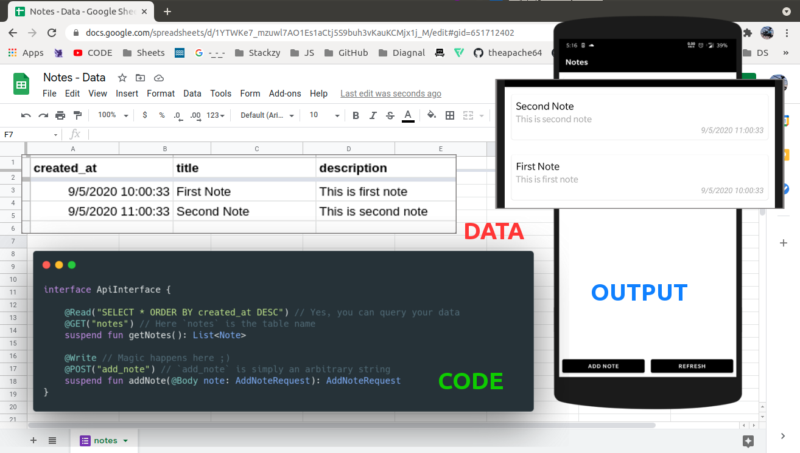

# 📝 retrosheet
Turn Google Spreadsheet to JSON endpoint.



## 🤝 Benefits

- 🔥 Free analytics via Google forms 
- 🔄 Migrate to your REST API with minimal code changes.
- 📊 You get a easy to use and real time interface for your data (GoogleSheet) ;)
- 🏃‍♂️ Speed up development of your POC or MVP with this library.


## 🚀 Platform Supported

   


## 🤝 Install


```kotlin
repositories {
    mavenCentral()
}

dependencies {
    implementation("io.github.theapache64:retrosheet:<latest.version>")
}
```

## ⌘️ Setup (using wizard)


Using the wizard, you can setup the backend in ~3 mins

**Steps:**
1. Create a Google Form (if you want to write data) or a Google Sheet (if you want to read data) or both.
2. Publish as usual and fill up the form in [wizard](https://a64.in/retrosheet/wizard/) 🧙🏼‍♂️
3. Press `Generate Code` and copy paste it into your project

**📹 Video Demo: https://www.youtube.com/watch?v=eWDquVbsebg**


## ⌘️ Setup (manual)

### ✍️ Writing Data

#### 📝 Step 1: Create a Google Form
Create a form with required fields.  


#### 🎯 Step 2: Set Response Destination
Choose a Google Sheet to save responses.  
  


#### ⚙️ Step 2.1: Enable Response Editing (Optional)
If you plan to use the Update feature, go to **Settings** → **General** → Enable **"Allow response editing"**.

#### 📊 Step 3: Customize Sheet
Rename sheet and columns (optional).  
  


#### 🔗 Step 4: Get Form Link
Press `Send` and copy the link.  


#### 🔧 Step 5: Create `RetrosheetConfig` and attach it to the client
```kotlin
val config = RetrosheetConfig.Builder()
    .setLogging(true)
    // For reading from sheet
    .addSheet(
        "notes", // sheet name
        "created_at", "title", "description" // columns in same order
    )
    // For writing to sheet
    .addForm(
        "add_note",
        "https://docs.google.com/forms/d/e/1FAIpQLSdmavg6P4eZTmIu-0M7xF_z-qDCHdpGebX8MGL43HSGAXcd3w/viewform?usp=sf_link" // form link
    )
    .build()

val ktorClient = HttpClient {
    install(createRetrosheetPlugin(config)) {}
    ...
}
```

#### 🌐 Step 6: Create API Interface
```kotlin
import de.jensklingenberg.ktorfit.http.*
import io.github.theapache64.retrosheet.annotations.Read
import io.github.theapache64.retrosheet.annotations.Update
import io.github.theapache64.retrosheet.annotations.Write

interface NotesApi {
    @Read("SELECT *")
    @GET("notes")
    suspend fun getNotes(): List<Note>

    @Write
    @POST("add_note")
    suspend fun addNote(@Body note: Note): String
    
    @Update
    @POST("add_note")
    suspend fun updateNote(@Tag updateKey: String, @Body note: Note): Note
}
```

> **@Write** is used for adding data, **@Read** for reading data, and **@Update** for updating existing row.

[Query Language Guide](https://developers.google.com/chart/interactive/docs/querylanguage)

### 📚 Reading Data

#### 🔄 Step 7: Share Sheet
Open a sheet and copy its shareable link.  


#### ✂️ Step 8: Edit Link
Trim the link after the last '/'.

`https://docs.google.com/spreadsheets/d/1IcZTH6-g7cZeht_xr82SHJOuJXD_p55QueMrZcnsAvQ`~~/edit?usp=sharing~~

#### 🔗 Step 9: Set Base URL
Use the trimmed link as `baseUrl` in `Ktorfit`.

```kotlin
val retrofit = Ktorfit.Builder()
    // Like this 👇🏼
    .baseUrl("https://docs.google.com/spreadsheets/d/1YTWKe7_mzuwl7AO1Es1aCtj5S9buh3vKauKCMjx1j_M/")
    .httpClient(ktorClient)
    .converterFactories(RetrosheetConverter(config))
    .build()
```

**Done 👍**

### 🔄 Updating Data

The Update feature allows you to modify existing rows in your Google Sheet. Here's how to set it up:

#### 📝 Step 1: Enable Response Editing
In your Google Form, go to **Settings** → **General** → Enable **"Allow response editing"**.


#### 🔧 Step 2: Get Update Key
When adding data that you might want to update later, return a `String` from your `@Write` function instead of the object:

```kotlin
@Write
@POST("add_note")
suspend fun addNoteForUpdate(@Body note: Note): String
```

The returned `String` is the `updateKey` that you'll use to update the row later.

#### 🔄 Step 3: Update the Row
Use the `@Update` annotation with the `updateKey` as a `@Tag` parameter:

```kotlin
@Update
@POST("add_note")
suspend fun updateNote(@Tag updateKey: String, @Body note: Note): Note
```

#### 📝 Example Usage
```kotlin
// Add a note and get the update key
val updateKey = notesApi.addNoteForUpdate(
    Note("Initial Title", "Initial Description")
)

// Later, update the note using the key
notesApi.updateNote(
    updateKey,
    Note("Updated Title", "Updated Description")
)
```

> **⚠️ Important**: Make sure to enable **"Allow response editing"** in your Google Form settings, otherwise the update feature won't work.

**Done 👍**

## 🌠 Full Example

**build.gradle.kts**
```kotlin
plugins {
    kotlin("jvm") version "2.1.10"
    id("org.jetbrains.kotlin.plugin.serialization") version "2.1.10"
    id("com.google.devtools.ksp") version "2.1.10-1.0.31"
    id("de.jensklingenberg.ktorfit") version "2.5.1"
}
...
dependencies {
    implementation("io.ktor:ktor-client-content-negotiation:3.1.3")
    implementation("io.ktor:ktor-serialization-kotlinx-json:3.1.3")
    implementation("de.jensklingenberg.ktorfit:ktorfit-lib:2.5.1")
    implementation("io.github.theapache64:retrosheet:3.0.0")
    testImplementation(kotlin("test"))
}
...
```

**NotesApi.kt**

```kotlin
import de.jensklingenberg.ktorfit.http.*
import io.github.theapache64.retrosheet.annotations.Read
import io.github.theapache64.retrosheet.annotations.Update
import io.github.theapache64.retrosheet.annotations.Write

interface NotesApi {
    @Read("SELECT *")
    @GET("notes")
    suspend fun getNotes(): List<Note>

    @Write
    @POST("add_note")
    suspend fun addNote(@Body note: Note): Note
    
    @Write
    @POST("add_note")
    suspend fun addNoteForUpdate(@Body note: Note): String
    
    @Update
    @POST("add_note")
    suspend fun updateNote(@Tag updateKey: String, @Body note: Note): Note
}
```

**Main.kt**
```kotlin
@Serializable
data class Note(
    @SerialName("Title")
    val title: String,
    @SerialName("Description")
    val description: String?,
    @SerialName("Timestamp")
    val createdAt: String? = null,
)


suspend fun main() {
    val notesApi = createMyNotesApi()
    println(notesApi.getNotes())

    // Adding sample note
    val newNote = notesApi.addNote(
        Note(
            createdAt = null,
            title = "Dynamic Note 1",
            description = "Dynamic Desc 1: ${Date()}"
        )
    )
    println("Added: $newNote")

    // Adding note for update and getting update key
    val updateKey = notesApi.addNoteForUpdate(
        Note(
            createdAt = null,
            title = "Note to Update",
            description = "Original Description: ${Date()}"
        )
    )
    println("Update key: $updateKey")

    // Updating the note
    val updatedNote = notesApi.updateNote(
        updateKey,
        Note(
            createdAt = null,
            title = "Updated Note Title",
            description = "Updated Description: ${Date()}"
        )
    )
    println("Updated: $updatedNote")
}


fun createMyNotesApi(
    configBuilder: RetrosheetConfig.Builder.() -> Unit = {}
): NotesApi {
    val config = RetrosheetConfig.Builder()
        .apply { this.configBuilder() }
        .setLogging(true)
        // To Read
        .addSheet(
            "notes", // sheet name
            "created_at", "title", "description" // columns in same order
        )
        // To write
        .addForm(
            "add_note",
            // Google form name
            "https://docs.google.com/forms/d/e/1FAIpQLSdmavg6P4eZTmIu-0M7xF_z-qDCHdpGebX8MGL43HSGAXcd3w/viewform?usp=sf_link"
        )
        .build()

    val ktorClient = HttpClient {
        install(createRetrosheetPlugin(config)) {}
        install(ContentNegotiation) {
            json()
        }
    }

    val ktorfit = Ktorfit.Builder()
        // GoogleSheet Public URL
        .baseUrl("https://docs.google.com/spreadsheets/d/1YTWKe7_mzuwl7AO1Es1aCtj5S9buh3vKauKCMjx1j_M/")
        .httpClient(ktorClient)
        .converterFactories(RetrosheetConverter(config))
        .build()

    return ktorfit.createNotesApi()
}
```
- Source: https://github.com/theapache64/retrosheet-jvm-sample. Check `sample` directory for more samples

## 🔄 Migration
- Want to migrate from v1 or v2?Here's the [guide](https://github.com/theapache64/retrosheet/blob/master/MIGRATION.md)

## Must Read ✋🏼
Retrosheet is great for prototyping and not recommended to be used in production for real apps. This is because the library makes direct calls to Google APIs—so if those APIs go down, your app goes down with them.

That said, I do use it in production for a few of my [side projects](https://github.com/theapache64/stackzy) :P, and it has been working fine for over 5 years now. (So if things break, I’ll be right there, drowning in tears with you.)

## ✍️ Author
- theapache64  

